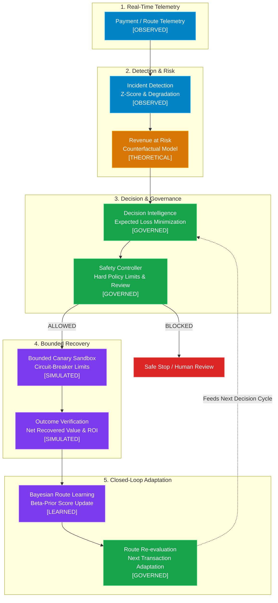
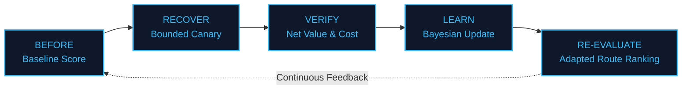

# RouteIQ

### Intelligent Payment Route Recovery

> Catch payment failures early. Route smarter. Recover safely.

RouteIQ detects localized payment route degradations in real time, quantifies revenue at risk, selects optimal fallback routes, enforces deterministic safety policies, validates recovery through bounded canary sandboxes, and learns continuously from verified outcomes.

---

## The Problem

Payment failures don't always mean the customer or transaction is bad.

Sometimes **the route is the problem**.

```
Specific Route Degrades (e.g., UPI + Bank_X + Android)
                  ↓
          Payments Drop Out
                  ↓
       Revenue & Trust Lost
```

When a single bank gateway experiences latency or drops, standard systems either repeatedly retry the failing route or blast human alerts. RouteIQ isolates the degraded route and orchestrates automated, safety-bounded recovery.

---

## Architecture



---

## Closed Loop



> **Verified recovery results improve future route decisions.**

---

## How It Works

- **01 — Detect**: Finds localized route drops using statistical baselines ($Z \ge 2.5, \Delta \ge 5.0\text{ pp}$).
- **02 — Quantify**: Calculates modeled Revenue at Risk before taking action.
- **03 — Decide**: Evaluates alternate candidate routes to minimize expected loss.
- **04 — Protect**: Enforces deterministic safety thresholds and human-review gates.
- **05 — Test**: Runs a small, bounded canary batch through the candidate route.
- **06 — Verify**: Measures actual recovered value against execution costs.
- **07 — Learn**: Updates Bayesian route scores in $<5\text{ms}$ using verified evidence.

---

## Why RouteIQ

| Generic Recovery | RouteIQ |
|---|---|
| Retry failures blindly | Detect multi-dimensional route degradation |
| Retry on the same failing route | Compare healthy alternative candidate routes |
| All-or-nothing bulk traffic shift | Bounded canary sandbox with safety limits |
| Blind retry assumption | Net value verification accounting for cost |
| Static configuration | Closed-loop Bayesian learning from evidence |
| Action executed first | Deterministic safety gate before execution |

---

## Safety Governance

```
AI Route Recommendation
           ↓
      Safety Gate
           ↓
     Can Execute?
     ├── YES ──→ Bounded Canary ──→ Recovery
     └── NO  ──→ STOP / HUMAN REVIEW REQUIRED
```

- **Exposure Limits**: Automated action is blocked if financial risk exceeds ₹500,000.
- **Human-Review Controls**: Flags high-exposure or ambiguous incidents for operator review.
- **Canary Limits**: Constrains initial routing shift to a micro-batch (e.g. 20 txns).
- **Stop Conditions**: Sub-threshold degradations ($<5.0\text{ pp}$) are held in `MONITOR` status.
- **Circuit Breaker & Rollback**: Reverses routing immediately if canary degrades or proves unprofitable.
- **Audit Trail**: Every decision, check, and execution step is immutably logged with timestamps.

---

## Demo Results

*Canonical Demonstration Scenario (`UPI + Bank_X + Android`)*:

| Metric | Result | Provenance |
|---|---|---|
| **Incident Severity** | **CRITICAL** | `[OBSERVED]` |
| **Degradation** | **25.0 pp** (95% → 70%) | `[OBSERVED]` |
| **Revenue at Risk** | **₹355,840** | `[THEORETICAL / COUNTERFACTUAL]` |
| **Selected Alternative** | **`ROUTE_SWITCH: UPI + Bank_A + Android`** | `[GOVERNED]` |
| **Safety Gate** | **`ALLOWED`** | `[GOVERNED]` |
| **Canary Success** | **19 / 20 recovered (95.0%)** | `[SIMULATED]` |
| **Gross Recovered** | **₹2,500.00** | `[SIMULATED]` |
| **Execution Cost** | **₹125.00** | `[SIMULATED]` |
| **Net Recovered Value** | **₹2,375.00** | `[SIMULATED]` |
| **Recovery ROI** | **19.00x** | `[SIMULATED]` |
| **Learning Score Delta** | **+0.2298** (0.7500 → 0.9798) | `[LEARNED]` |

> ⚠️ **All payment execution and recovery results are simulated in a bounded sandbox. No real production payment routing is performed.**

---

## Benchmark Evaluation

Evaluated across deterministic incident detection and safety policy benchmark datasets:

| Metric | Score | Note |
|---|---|---|
| **Precision** | **100.0%** | Zero false-positive route interventions triggered |
| **Recall** | **66.7%** | Conservative detection on low-evidence boundary cases |
| **F1 Score** | **80.0%** | Balanced precision/recall benchmark score |
| **Specificity** | **100.0%** | Perfectly rejects normal operational variance |
| **Accuracy** | **80.0%** | Strict deterministic benchmark classification |

*Boundary case note*: Low-evidence noise is held in `MONITOR` status to preserve 100% precision and avoid disruptive routing flapping.

---

## Data Provenance

| Label | Meaning | Project Example |
|---|---|---|
| `[OBSERVED]` | Measured telemetry from simulated payment events | Success rates, transaction counts |
| `[THEORETICAL]` | Modeled counterfactual risk projections | Revenue at Risk, expected loss |
| `[SIMULATED]` | Bounded sandbox recovery execution | Attempted amount, net recovered value |
| `[GOVERNED]` | Deterministic safety policy & benchmark metrics | Safety decision, precision/recall |
| `[LEARNED]` | Statistical updates from verified recovery evidence | Bayesian Beta-prior route scores |

---

## Tech Stack

- **Core Engine**: Python 3.11+ / NumPy / Pandas / SciPy
- **UI & Visualization**: Streamlit, Mermaid.js
- **Testing & Quality Assurance**: Pytest (304 tests), Python compileall, Flake8

---

## Project Structure

```text
src/
├── intelligence/    # Incident detection, route scoring, revenue at risk
├── decision/        # Expected loss minimization & decision explanation
├── safety/          # Deterministic safety controller & policy checks
├── recovery/        # Bounded canary, batch orchestrator, recovery executor
├── tracking/        # Closed-loop Bayesian learning & financial summaries
├── evaluation/      # Benchmark suite, evaluation scorecard, metrics
└── demo/            # Deterministic DemoRunner, scenarios, view models

app.py               # Streamlit control center dashboard
tests/               # 304 automated unit and regression tests
```

---

## Demo Scenarios

| Scenario | What It Demonstrates | Expected Safety State | Expected Recovery State |
|---|---|---|---|
| **Canonical Happy Path** | Complete 8-stage recovery loop | `ALLOWED` | `RECOVERED` (Net: ₹2,375, ROI: 19x) |
| **Safety Blocked** | High exposure ($> ₹500\text{k}$) blocks automation | `BLOCKED` (Human Review) | `NOT EXECUTED` (ROI: N/A) |
| **Unprofitable Rollback** | Circuit breaker trips on degraded canary | `ALLOWED` | `ROLLED_BACK` (Guardrail Trip) |

---

## Quickstart

```bash
# 1. Clone repository
git clone https://github.com/yuktha2005/razorpay-ai-recovery.git
cd razorpay-ai-recovery

# 2. Install dependencies
pip install -r requirements.txt

# 3. Run full test suite (304 tests)
python -m pytest -q

# 4. Launch Streamlit control dashboard
streamlit run app.py
```

Open `http://localhost:8501` to access the RouteIQ dashboard.

---

## Limitations

- **Simulated Execution**: All recovery actions run in a bounded deterministic sandbox; production use requires gateway API write hooks.
- **Local Learning State**: Bayesian updates persist across session and local store; distributed multi-region sync would use Redis/Spanner.
- **Latency Distribution**: Telemetry modeling approximates gateway response latency via Gaussian distributions.

---

> ### **Detect the route. Protect the payment. Recover the revenue.**
>
> **RouteIQ** — Intelligent Payment Route Recovery