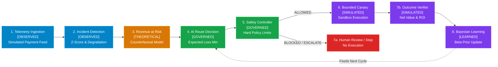

# RouteIQ — Intelligent Payment Route Recovery

**RouteIQ** is a deterministic, safety-governed payment route reliability and revenue recovery engine. It detects localized payment route degradations, quantifies revenue at risk, selects optimal alternative routes, enforces deterministic safety policies, tests recovery through bounded canary sandboxes, verifies financial outcomes, and closes the loop via Bayesian route learning.

> ### ⚠️ Simulation Disclaimer
> **All payment execution, recovery execution, routing interventions, and financial recovery metrics in RouteIQ are simulated in a bounded sandbox environment for demonstration and benchmarking purposes.**
> No live production banking APIs are altered, no real monetary transfers are executed, and no live customer payments are processed.

---

## 1. Problem Statement

In high-volume payment infrastructure, outages rarely take down an entire payment gateway uniformly. Instead, failures are typically localized to specific multi-dimensional tuples:

$$\text{Route} = \text{Payment Method} \times \text{Bank / Processor} \times \text{Device / Channel}$$

*Example*: **UPI + Bank_X on Android** drops from a 95% baseline success rate to 70%, while all other bank routes remain healthy.

Conventional monitoring triggers generic alerts that wake up engineers, but leaves critical operational questions unanswered:
1. **Which exact sub-route** is degraded?
2. **What is the modeled financial exposure** (Revenue at Risk)?
3. **Which alternative route** has the highest statistical probability of recovery?
4. **Is automated intervention safe**, or does exposure exceed governance policy thresholds?
5. **How can recovery be safely validated** before shifting volume?
6. **How does the system adapt** so the next transaction doesn't repeat the failure?

---

## 2. Objective

RouteIQ automates the end-to-end payment reliability lifecycle:
$$\text{Detect} \longrightarrow \text{Quantify} \longrightarrow \text{Decide} \longrightarrow \text{Safety-Gate} \longrightarrow \text{Canary} \longrightarrow \text{Recover} \longrightarrow \text{Verify} \longrightarrow \text{Learn} \longrightarrow \text{Adapt}$$

The primary objective is **route-level payment reliability and revenue recovery**, minimizing customer drop-off while strictly preventing unconstrained financial loss through deterministic safety controls.

---

## 3. Solution Overview

RouteIQ decouples AI decision intelligence from production execution authorization:
- **Statistical Telemetry Intelligence**: Continuous anomaly detection using Z-score baselining ($Z \ge 2.5$) and minimum degradation thresholds ($\ge 5.0\text{ pp}$).
- **Counterfactual Financial Risk Modeling**: Quantifies Revenue at Risk before taking action.
- **Expected Loss Minimization**: Evaluates candidate routes and recommends the optimal routing switch.
- **Deterministic Safety Governance**: Hard policy guardrails (e.g. ₹500,000 maximum automated exposure threshold) that can veto any recommendation and require human review.
- **Bounded Canary Sandbox**: Executes a small canary batch (e.g., 20–50 txns) with circuit-breaker rollback triggers.
- **Closed-Loop Bayesian Learning**: Verified recovery evidence updates Beta priors on route scores in $<5\text{ms}$ without black-box ML retraining.

---

## 4. System Architecture



### Core Subsystems & Provenance Tiers

RouteIQ enforces strict 5-tier metric provenance:
1. **`[OBSERVED]`**: Directly measured telemetry from simulated payment events (e.g., observed success rate, failure counts).
2. **`[THEORETICAL / COUNTERFACTUAL]`**: Modeled pre-intervention projections (e.g., Revenue at Risk, Expected Loss Before/After).
3. **`[SIMULATED]`**: Results from bounded sandbox recovery execution (e.g., Attempted Amount, Gross Recovered, Execution Cost, Net Recovered Value).
4. **`[GOVERNED / EVALUATED]`**: Deterministic policy decisions and benchmark evaluation scores (e.g., Safety Gate status, Precision/Recall).
5. **`[LEARNED]`**: Evidence-based statistical updates (e.g., Bayesian Beta-prior route scoring updates).

---

## 5. End-to-End Demo Flow

The judge-ready Streamlit control center executes an 8-stage deterministic lifecycle:

1. **DETECT**: Ingests route telemetry and identifies a statistical drop ($\Delta \ge 25\text{ pp}$, $Z \ge 2.5$).
2. **QUANTIFY**: Computes modeled Revenue at Risk ($\text{Excess Failures} \times \text{Avg Txn Value}$).
3. **DECIDE**: Evaluates candidate banks (`Bank_A`, `Bank_B`, `Bank_C`) to minimize expected loss.
4. **SAFETY**: Safety Controller validates exposure against policy limits ($\le ₹500,000$).
5. **CANARY**: Executes a 20-transaction canary batch through `Bank_A`.
6. **VERIFY**: Confirms canary recovery rate ($\ge 90\%$) and calculates Net Recovered Value.
7. **LEARN**: Accumulates verified recovery evidence into Bayesian Beta priors.
8. **ADAPT**: Re-evaluates routing candidates; `Bank_A` becomes the top-ranked route for subsequent traffic.

---

## 6. Safety Controls & Policy Governance

Safety is an independent governance layer decoupled from route recommendation:

```
AI Recommendation Engine (Advisory)
           ↓
   Safety Controller (Gatekeeper)
           ↓
   Execution Authorization
```

### Safety Policies
- **Exposure Cap**: If modeled Revenue at Risk exceeds ₹500,000, automated recovery is **`BLOCKED`** and flagged for **`HUMAN REVIEW REQUIRED`**.
- **Degradation Floor**: Degradations under 5.0 pp are classified as normal variance (**`STOP` / `MONITOR`**).
- **Alternative Health Verification**: The candidate recovery route must have historical success rate $\ge 90\%$.
- **Circuit Breaker**: If canary recovery drops below the baseline threshold or execution cost exceeds recovered amount, the system triggers an immediate **`ROLLBACK`**.

---

## 7. Financial Evaluation & Provenance

All recovery economics are strictly bounded and verified:

$$\text{Net Recovered Value} = \text{Gross Recovered Amount} - \text{Execution Cost}$$

$$\text{Recovery ROI} = \frac{\text{Gross Recovered Amount}}{\text{Execution Cost}} \quad (\text{only when Execution Cost} > 0)$$

When safety blocks execution or recovery does not run:
- **Attempted Amount**: ₹0.00
- **Gross Recovered**: ₹0.00
- **Execution Cost**: ₹0.00
- **Net Recovered Value**: ₹0.00
- **ROI**: `N/A — no execution cost recorded`

---

## 8. Closed-Loop Bayesian Learning

Rather than relying on opaque deep learning models or periodic offline batch retraining, RouteIQ uses **closed-loop Bayesian updating**:

$$\text{Beta Prior}(\alpha, \beta) \xrightarrow{\quad +(\text{successes}, \text{failures}) \quad} \text{Beta Posterior}(\alpha + k, \beta + n - k)$$

$$\text{Route Score} = \frac{\alpha + k}{\alpha + \beta + n} \times \text{Latency Penalty} \times \text{Volume Weight}$$

- **Execution Speed**: Score update executes in $<5\text{ ms}$.
- **Evidence Weighting**: Updates only occur from *verified* sandbox outcomes.
- **Safety**: Statistical priors prevent extreme swings from small sample sizes.

---

## 9. Evaluation & Benchmark Results

RouteIQ includes a deterministic evaluation benchmark suite (`src/evaluation/`):
- **Incident Detection Precision / Recall / F1**: Evaluated across synthetic anomaly injection datasets.
- **Safety Policy Compliance**: 100% adherence to exposure thresholds and human-in-the-loop triggers.
- **Test Suite**: **304 unit and regression tests** passing with 0 failures.

---

## 10. Technology Stack

- **Core Logic**: Python 3.11+ / NumPy / Pandas / SciPy
- **User Interface**: Streamlit (Modern dark/light fintech design system with custom CSS tokens)
- **Visualization**: Streamlit native charts, Mermaid diagrams
- **Testing & QA**: Pytest, compileall, flake8 / git diff check

---

## 11. How to Run

### Prerequisites
- Python 3.10+ installed
- Virtual environment recommended

### Installation & Execution
```bash
# Clone repository
git clone https://github.com/yuktha2005/razorpay-ai-recovery.git
cd razorpay-ai-recovery

# Install dependencies
pip install -r requirements.txt

# Run complete test suite (304 tests)
python -m pytest -q

# Start Streamlit application
streamlit run app.py
```

Open `http://localhost:8501` in your browser.

---

## 12. Demonstration Scenarios

In the Streamlit UI, select from 3 canonical scenarios:

1. **Canonical Happy Path**:
   - UPI + Bank_X drops by 25 pp.
   - AI selects Bank_A. Safety allows execution.
   - Canary recovers 19/20 transactions.
   - Closed-loop learning raises Bank_A route score by $+0.23$.
2. **Safety Blocked (Critical Exposure)**:
   - Enterprise volume drops; Revenue at Risk is ₹1,250,000 ($> ₹500,000$).
   - Safety Gate blocks automated execution (`HUMAN REVIEW REQUIRED`).
   - Recovery remains `NOT EXECUTED`, ROI safely displays `N/A`.
3. **Unprofitable Canary Rollback (Circuit Breaker)**:
   - Candidate route experiences unexpected failures during canary.
   - Execution cost exceeds recovery value.
   - Circuit breaker triggers automatic `ROLLBACK`.

---

## 13. Limitations

- Telemetry is simulated from synthetic transaction distributions.
- Bayesian learning updates route preferences within session state and local persistent history; production multi-region sync would require distributed state storage (e.g., Redis / Spanner).
- Network jitter and gateway API latency are modeled via Gaussian distributions.

---

## 14. Simulation & Compliance Disclaimer

RouteIQ was developed for the Razorpay AI Buildathon. All transaction logs, route telemetry, bank responses, recovery actions, and financial values are counterfactual simulations generated for research and demonstration. No actual merchant funds, banking networks, or production routing tables are modified.