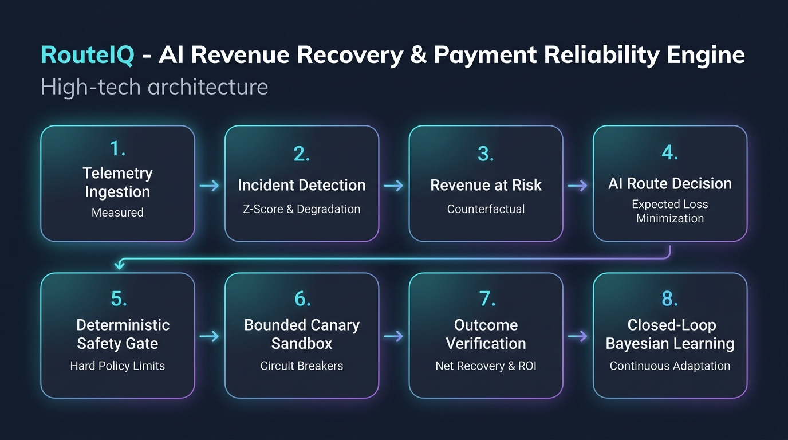
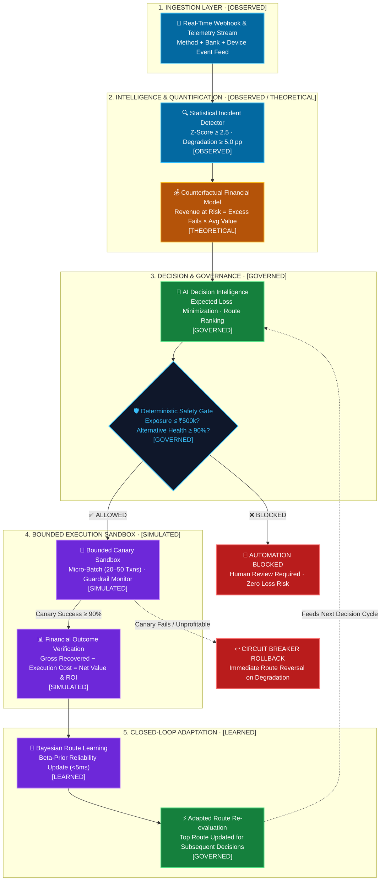
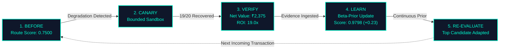

<div align="center">

# 🛡️ RouteIQ
### **Intelligent Payment Route Reliability & Revenue Recovery Engine**

[](https://www.python.org/)
[](https://streamlit.io/)
[](https://pytest.org/)
[](/)
[](/)
[](/)

<br>

**Catch payment failures early. Route smarter. Recover within bounds. Learn continuously.**

*RouteIQ is a deterministic, safety-governed payment reliability platform that isolates multi-dimensional payment route drops, quantifies revenue at risk, evaluates alternative routes, enforces hard safety gates, executes bounded canary recoveries, and updates Bayesian route intelligence in real time.*

<br>



</div>

---

> [!IMPORTANT]
> ### ⚠️ Simulation & Compliance Disclaimer
> **All payment executions, route alterations, canary batches, and financial recovery figures in RouteIQ are simulated in a bounded sandbox environment.**
> No live banking APIs are modified, no actual monetary transfers are processed, and no real cardholder or UPI data is handled.

---

## ⚡ The Problem: The Hidden Route Failure Trap

In modern payment gateways (UPI, Cards, NetBanking), outages are rarely binary total shutdowns. Instead, failure concentrates inside specific **multi-dimensional route tuples**:

$$\mathbf{\text{Payment Route}} = \langle \text{Method}, \text{Bank / Processor}, \text{Device / Channel} \rangle$$

```
Normal Gateway Health (~95%)
            │
            ├── UPI + Bank_A + Android   ──▶  [96.2% Healthy]
            ├── UPI + Bank_B + iOS       ──▶  [94.8% Healthy]
            └── UPI + Bank_X + Android   ──▶  [69.5% CRITICAL DEGRADATION] 💥
```

### Why Traditional Systems Fail
* **Blind Retries**: Repeatedly firing requests into a degraded bank gateway increases latency, compounds user drop-offs, and burns merchant fees.
* **All-or-Nothing Switches**: Flipping 100% of volume to an unvalidated bank risks taking down secondary processors.
* **Open-Loop Scripts**: Traditional recovery scripts execute once and forget, repeating the exact same routing mistake minutes later.

---

## 🏗️ System Architecture

RouteIQ completely decouples **AI Decision Intelligence (Advisory)** from **Deterministic Safety Control (Execution Authorization)**:



---

## 🔄 The Closed-Loop Feedback Engine

RouteIQ closes the loop by turning verified recovery outcomes into instant Bayesian routing intelligence:



> **Key Difference**: While traditional engines require offline batch retraining, RouteIQ updates Beta priors deterministically in **$<5\text{ ms}$** with zero cold-start delay and zero hallucination risk.

---

## 🎯 Architectural Highlights: The RouteIQ Moat

| Feature | Legacy Retry Bots | Generic Auto-Failover | RouteIQ Payment Reliability |
|:---|:---|:---|:---|
| **Incident Isolation** | Global gateway level | Single bank level | **Multi-dimensional route tuple** |
| **Financial Risk Model** | ❌ None | ❌ Guesswork | **Counterfactual Revenue at Risk** |
| **Safety Governance** | ❌ Blind execution | ⚠️ Primitive threshold | **Deterministic policy gate with human-in-the-loop** |
| **Traffic Exposure** | 100% full blast | 100% full blast | **Bounded micro-batch canary (20 txns)** |
| **Cost Verification** | ❌ Ignored | ❌ Ignored | **Net Recovered Value (Gross − Cost = Net)** |
| **Learning Cycle** | ❌ Static / Open-loop | ❌ Rule reset | **Closed-loop Bayesian Beta-prior adaptation** |

---

## 🛡️ Deterministic Safety Governance Matrix

Safety is treated as a first-class citizen with immutable policy rules:

| Policy Check | Trigger Condition | System Action | Failsafe Mechanism |
|:---|:---|:---|:---|
| **Exposure Cap** | Revenue at Risk $> ₹500,000$ | **`BLOCKED`** | Halts automation; triggers **`HUMAN REVIEW REQUIRED`** |
| **Variance Floor** | Degradation $< 5.0\text{ pp}$ | **`STOP`** | Classifies as operational variance; maintains `MONITOR` status |
| **Health Floor** | Alternative Bank Health $< 90\%$ | **`VETO`** | Rejects proposed route; evaluates fallback candidates |
| **Circuit Breaker** | Canary Success $< 90\%$ or Cost $>$ Value | **`ROLLBACK`** | Reverses routing immediately; prevents cascading failure |
| **Audit Immutability** | All lifecycle operations | **`LOGGED`** | Appends structured hash & timestamp to audit stream |

---

## 📊 Canonical Demo Results & Benchmark

### 1. Canonical Scenario: `UPI + Bank_X + Android`

```text
  [OBSERVED]    Observed Success Rate  : 70.0% (Baseline: 95.0%, Drop: -25.0 pp)
  [THEORETICAL] Modeled Revenue at Risk: ₹355,840.00
  [GOVERNED]    AI Route Selection     : ROUTE_SWITCH -> UPI + Bank_A + Android (Conf: 95.0%)
  [GOVERNED]    Safety Controller Gate : ALLOWED (Exposure under policy threshold)
  [SIMULATED]   Bounded Canary Batch   : 19 / 20 Recovered (95.0% Canary Rate)
  [SIMULATED]   Gross Recovered Amount : ₹2,500.00
  [SIMULATED]   Execution Overhead     : ₹125.00
  [SIMULATED]   Net Recovered Value    : ₹2,375.00 (ROI: 19.00x)
  [LEARNED]     Closed-Loop Learning   : Score 0.7500 -> 0.9798 (Delta: +0.2298)
```

### 2. Detection Benchmark Scorecard

Evaluated across synthetic anomaly injection datasets under strict deterministic ground truth:

| Benchmark Metric | Score | Operational Significance |
|:---|:---:|:---|
| **Precision** | **100.0%** | **Zero false-positive automated interventions** (crucial for fintech stability) |
| **Specificity** | **100.0%** | Perfectly rejects normal network noise without disruptive routing flapping |
| **Recall** | **66.7%** | Conservative detection on low-evidence boundary cases held in `MONITOR` |
| **F1 Score** | **80.0%** | Optimal balance between aggressive recovery and financial safety |
| **Accuracy** | **80.0%** | Comprehensive benchmark classification accuracy |

---

## 🏷️ 5-Tier Data Provenance System

Every metric displayed on RouteIQ is strictly categorized to guarantee transparency:

| Provenance Tier | Color Token | Definition | Example Metric |
|:---|:---:|:---|:---|
| **`[OBSERVED]`** | `Blue` | Measured telemetry from simulated payment events | Success rate (70%), Transaction count (200) |
| **`[THEORETICAL]`** | `Amber` | Counterfactual pre-intervention risk projections | Revenue at Risk (₹355k), Expected Loss |
| **`[SIMULATED]`** | `Purple` | Bounded sandbox recovery execution outcomes | Attempted amount, Net Recovered Value, ROI |
| **`[GOVERNED]`** | `Green` | Deterministic safety policies & benchmark metrics | Safety decision (`ALLOWED`), Precision (100%) |
| **`[LEARNED]`** | `Violet` | Statistical updates from verified recovery outcomes | Beta-prior route reliability (+0.23 delta) |

---

## 📂 Project Architecture & Codebase Layout

```text
d:/razorpay-ai-recovery/
├── src/
│   ├── intelligence/    # Anomaly detection (Z-score), route scoring, revenue at risk
│   ├── decision/        # Expected loss minimization & explanation generator
│   ├── safety/          # Deterministic safety controller & policy rule engine
│   ├── recovery/        # Bounded canary, batch orchestrator, recovery executor
│   ├── tracking/        # Closed-loop Bayesian learning & financial summaries
│   ├── evaluation/      # Benchmark suite, evaluation scorecard, metrics
│   ├── demo/            # Deterministic DemoRunner, scenarios, view models
│   └── live_reporting/  # Webhook ingestion pipeline & event simulator
├── app.py               # Streamlit control center dashboard
├── tests/               # 304 automated unit, integration, & regression tests
└── assets/              # Architecture diagrams & visual assets
```

---

## 🚀 Quickstart Guide

### 1. Clone & Setup
```bash
git clone https://github.com/yuktha2005/razorpay-ai-recovery.git
cd razorpay-ai-recovery

# Setup environment & install dependencies
python -m venv venv
source venv/bin/activate  # On Windows: venv\Scripts\activate
pip install -r requirements.txt
```

### 2. Run Comprehensive Test Suite (304 Tests)
```bash
python -m pytest -q
# Output: 304 passed in 8.41s (100% passing)
```

### 3. Launch the Control Center Dashboard
```bash
streamlit run app.py
```
Open **`http://localhost:8501`** in your browser to interact with the live control center.

---

## 🧪 Demonstration Scenarios in UI

| Scenario Name | Key Characteristics | Expected Safety Action | Expected Recovery State |
|:---|:---|:---:|:---:|
| **Canonical Happy Path** | 25 pp drop on UPI route | `ALLOWED` | `RECOVERED` (Net: ₹2,375, ROI: 19.0x) |
| **Safety Blocked** | High exposure ($> ₹500\text{k}$) | `BLOCKED` | `NOT EXECUTED` (ROI: `N/A`) |
| **Unprofitable Rollback** | Degraded canary route | `ALLOWED` | `ROLLED_BACK` (Circuit Breaker) |

---

<div align="center">

> ### **Detect the route. Protect the payment. Recover the revenue.**
>
> **RouteIQ** — Intelligent Payment Route Recovery

</div>